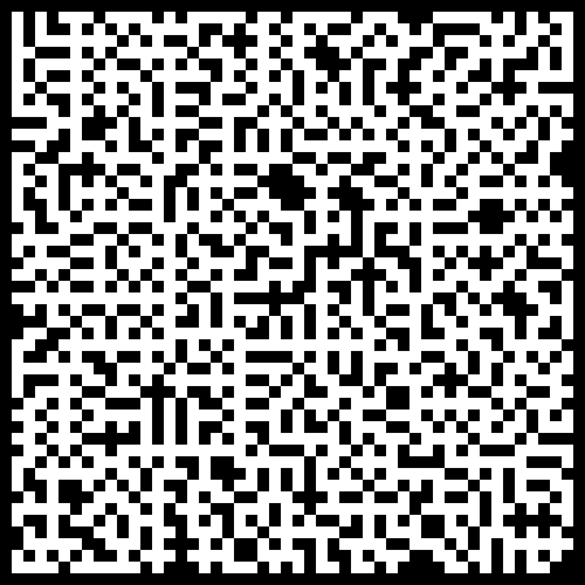
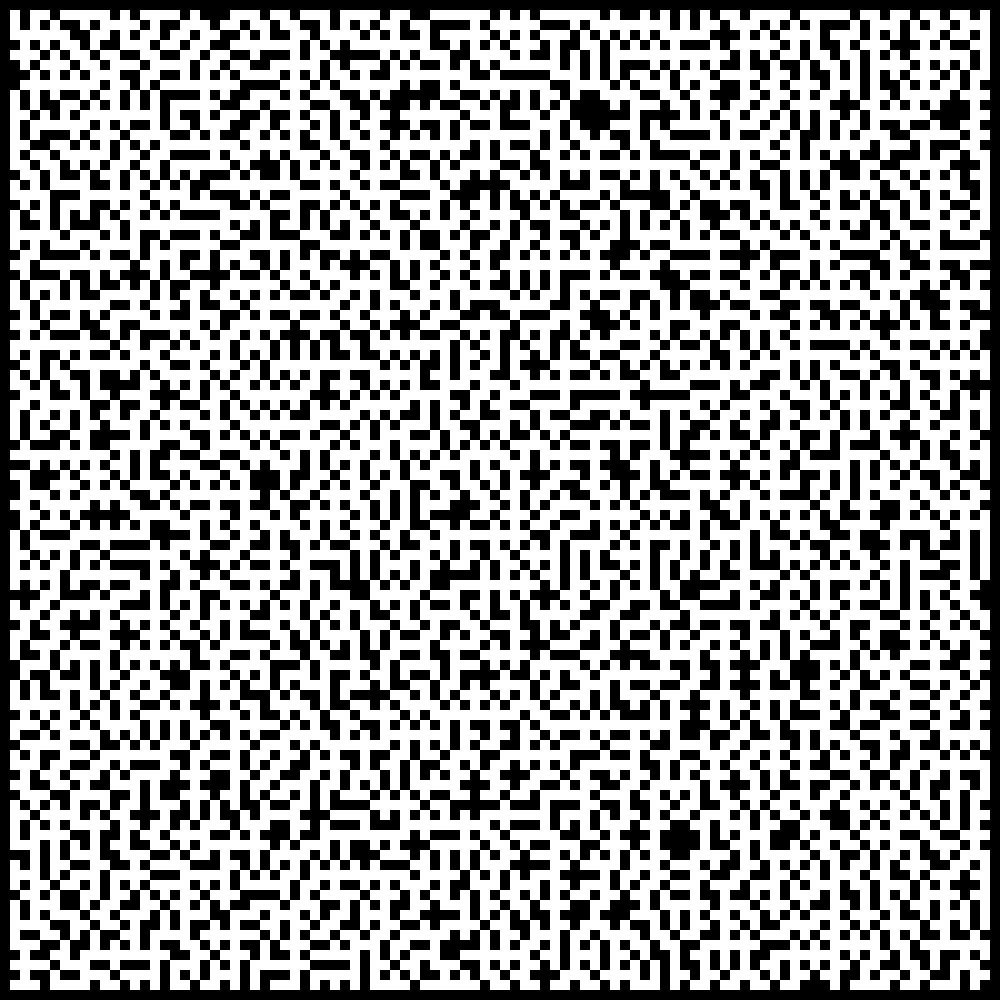

# Maze Generation Program

This program is designed to generate mazes. 
Additionally, `visualizer.py` allows you to create a graphical representation of the maze. 
The Fortran program itself only generates a text file.

## Usage

### Fortran Program
1. First, compile the `main.f95` program.
2. To run the program, provide 2 integer arguments: the number of rows and the number of columns.
   - Example: `./[compiled_program_name] 30 30`

### Visualizer
- Command: `python visualizer.py [generated_file.txt] [output_image.png] [block_size]`

The result is saved to a text file.

Additionally, the folder contains 2 mazes generated by me.

## File Structure

### `main.f95`
Contains 2 modules:
- `utils`
- `maze_generators`

#### `utils` Module
Contains helper functions for saving the maze to a file and generating integers within a specified range.

#### `maze_generators` Module
Contains the main algorithm procedure and its auxiliary functions.

The main array stores the maze in a logical format:
- `.TRUE.` -> Maze walls
- `.FALSE.` -> Maze paths

## Maze Generation Algorithm
The maze is generated using the Iterative randomized Prim's algorithm. [Learn more](https://en.wikipedia.org/wiki/Maze_generation_algorithm)

### Steps:
1. Start with an entire grid of walls (`.TRUE.`).
2. Choose a random cell in the grid and set it as a path (`.FALSE.`).
3. Add each wall surrounding the chosen cell to the wall list.
4. While the wall list is not empty:
   1. Choose a random wall from the list.
   2. If the cell on the opposite side of the wall has only one adjacent path:
      1. Add it to the maze.
      2. Add all neighboring walls to the wall list.
   3. Remove the wall from the list.

Additionally, a `visited` array is used to store information about each cell. It is of a logical type and indicates:
- `.TRUE.` -> the cell has been visited
- `.FALSE.` -> the cell has not been visited yet

Its purpose is to avoid looping when adding neighboring walls to the wall list.

## Examples

### Maze 10x15

### Maze 30x30

### Maze 50x50

### Maze 100x100

